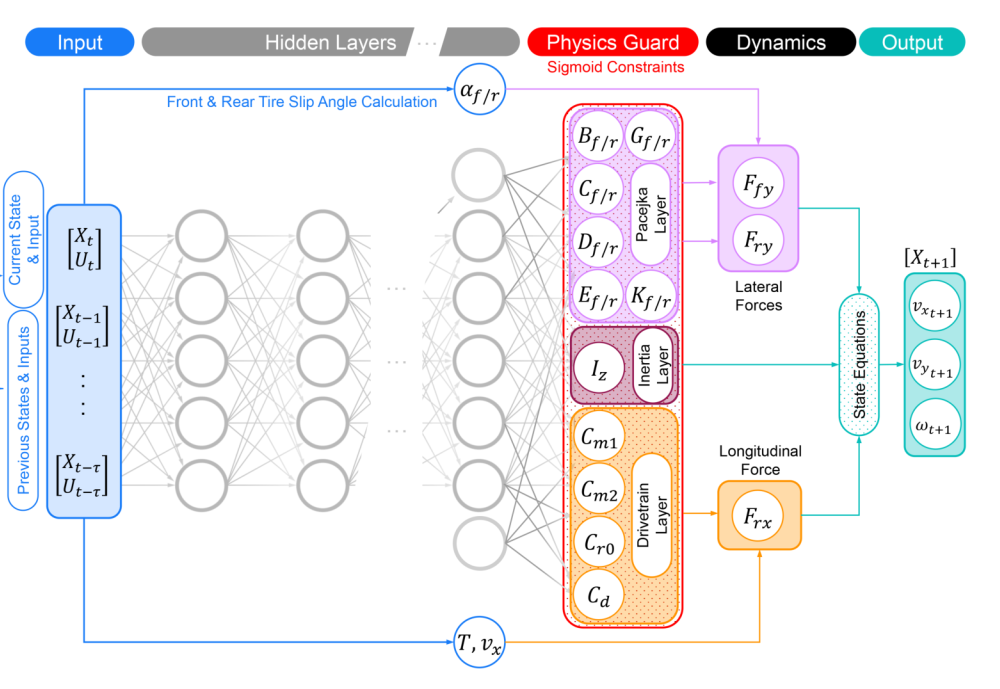
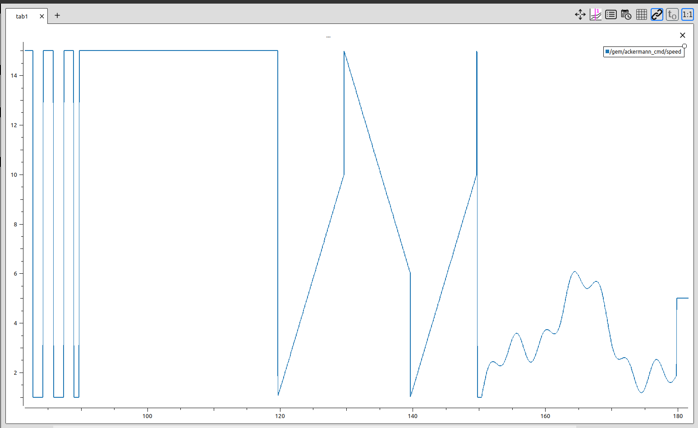
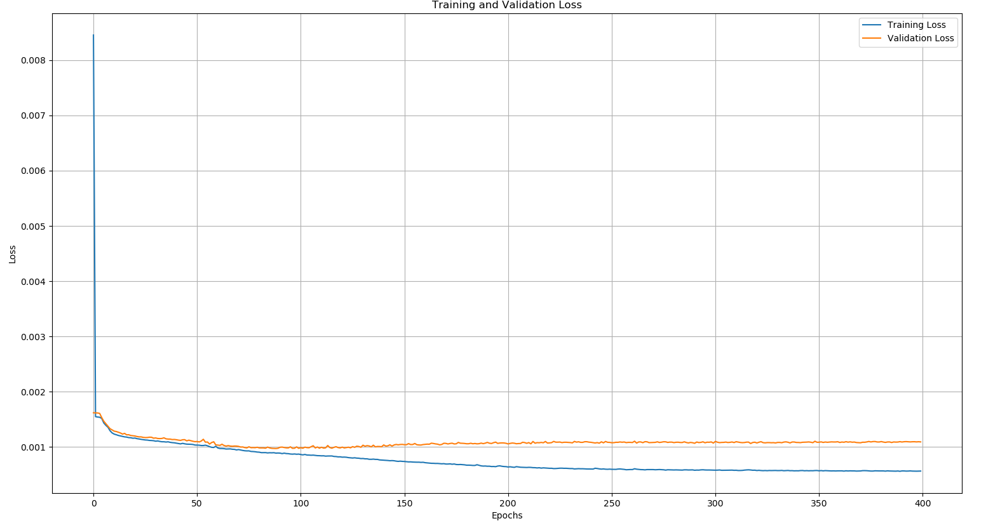
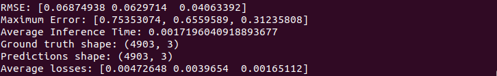
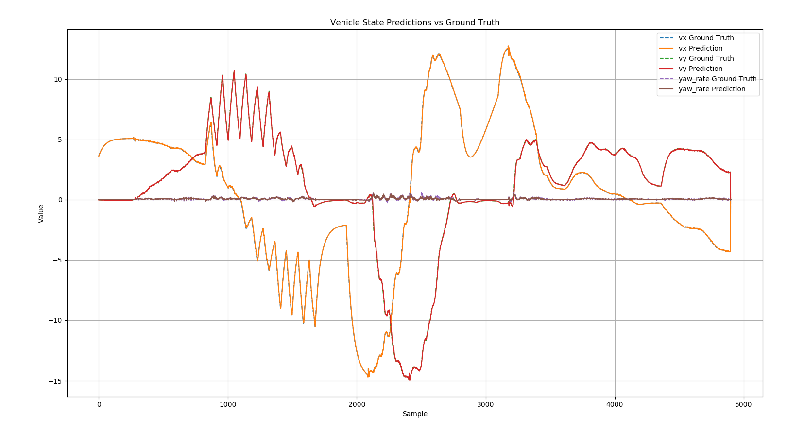
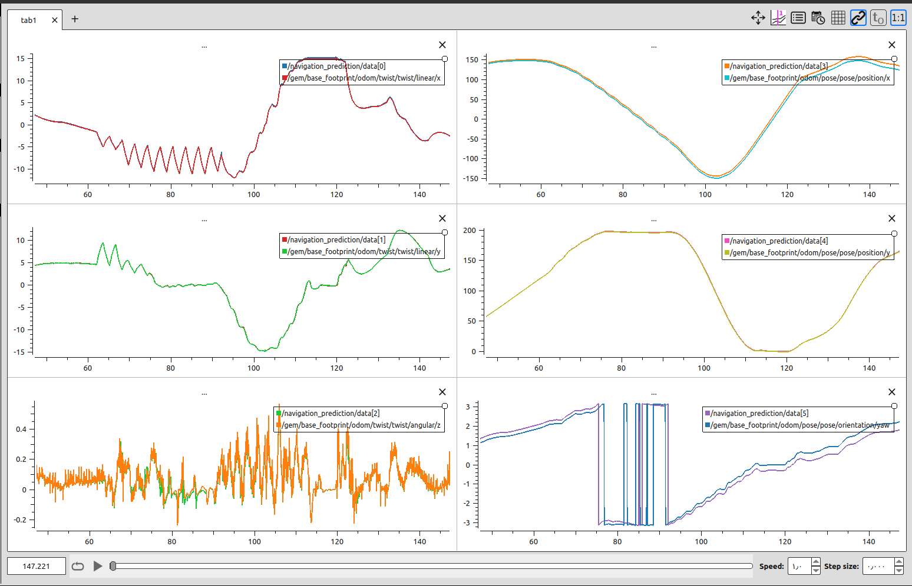
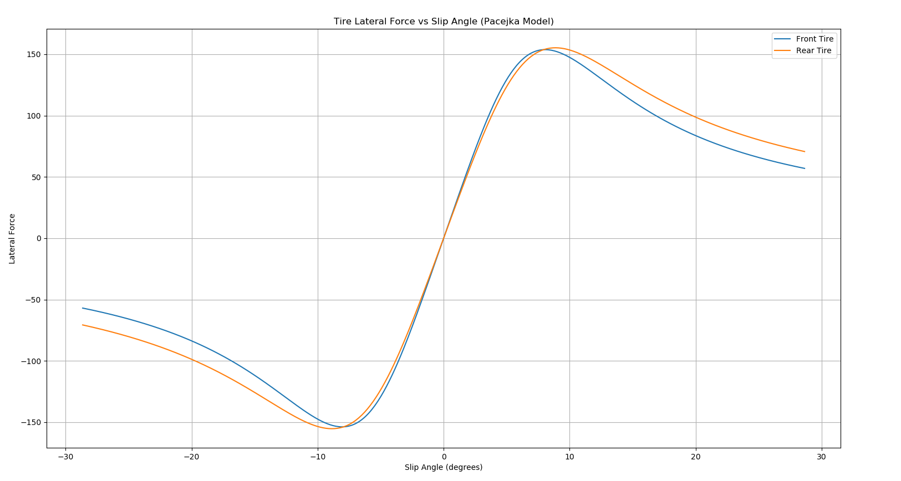

## Navigation Assessment 
### Step 1: System Identification
The system identification process was conducted using data collected from the simulator. Specifically, the vehicle’s pose, twist, and control commands were recorded. These datasets were then used to train a physics-informed recurrent neural network (RNN).

The RNN receives as input a sequence of system states together with the corresponding control actions, and predicts the next vehicle state. This enables the model to learn the underlying system dynamics while integrating physical constraints into the network design. The architecture of the RNN is illustrated below.

To capture the system dynamics, I used the PurePursuit controller provided in the simulator to track the reference path. In addition, I modified it to generate specific control actions, ensuring that the collected data sufficiently represented the system’s behavior, as shown below:

The control inputs consist of a combination of square waves, step inputs, ramp inputs, and composite sine waves. These diverse excitation signals are sufficient to capture the vehicle’s dynamics effectively.

After training the model with the collected data, the following results show the training and validation loss curves:

#### Model validation
The model demonstrates high accuracy, with the following performance metrics:

- RMSE: [0.0708, 0.0643, 0.0493]
- Maximum Error: [0.8573, 0.6706, 0.4429]
- Average losses: [0.00501455 0.00413023 0.00243084]

The following graph shows the predicted states alongside the ground truth data collected from the simulator.

After training and validation, the model was converted to ONNX runtime for inference. The results below illustrate the model’s performance in the simulator, where the vehicle is subjected to control actions different from those used during training. The model predicts vx, vy, and yaw rate, which are then used to compute x, y, and yaw. The figure below shows the predictions for all six states.

In addition, this model outputs the tire parameters as well as the moment of inertia. The learned tire parameters are listed below:

- Bf    5.5933237, Cf    1.9676332, Df    153.76212, Ef    -1.9988842
- Br    5.321919, Cr    1.9374299, Dr    155.27301, Er    -1.6906245
- Cm1    2068.396, Cm2    0.98745525, Cr0    0.21601874, Cr2    0.10296707
- Iz    1871.2806
- Shf    0.0008643251, Svf    14.142181, Shr    0.004732879, Svr    24.524963
